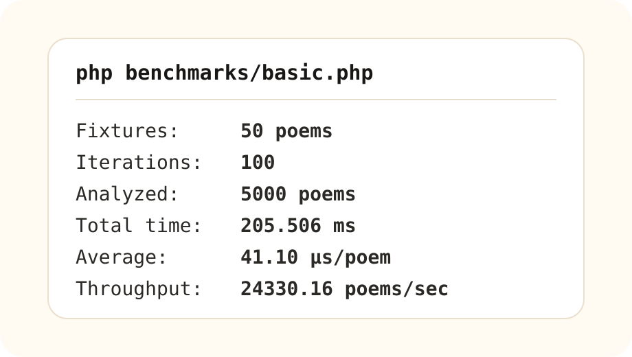

# Mosab Qafya Detector Documentation

Mosab Qafya Detector started as part of the core qafya analysis work behind **[موسوعة الشعراء](https://poetspedia.com)**, then became an open-source PHP package for Arabic poetry developers, researchers, and linguists.

---

## 1. What does the package do?

The package analyzes Arabic poem endings and extracts:

- **Rawi**: the core rhyme letter.
- **Radf**: the long/soft letter before rawi when stable.
- **Wasl**: the letter after rawi.
- **Khurooj**: the long vowel after haa wasl.
- **Taasis and dakhiil**: foundation alef and the letter between it and rawi.
- **Qafya pattern**: examples: `اها`, `دا`, `ابه`.
- **Poem-level qafya**: one rawi, multiple qafyas, dominant ratio, and review flags.
- **Defects and sanad**: review signals for irregularities.

The package is machine-assisted. It is designed to be safe for production use, but it does not replace human scholarly verification in ambiguous poems.

---

## 2. Installation

```bash
composer require helturkey/mosab-qafya-detector
```

Basic usage:

```php
use Mosab\QafyaDetector\QafyaDetector;

$detector = QafyaDetector::make();
```

---

## 3. Word or ending analysis

```php
$result = QafyaDetector::make()->extract('ناداها');

$result->rawi();           // ه
$result->radf();           // ا
$result->wasl();           // ا
$result->patternSurface(); // اها
```

Meaning:

```txt
ناداها
   ا ه ا
   radf + rawi + wasl
```

Another example:

```php
$result = QafyaDetector::make()->extract('كتابُهُ');

$result->rawi();           // ب
$result->radf();           // ا
$result->wasl();           // ه
$result->patternSurface(); // ابه
```

---

## 4. Poem analysis

```php
$analysis = QafyaDetector::make()->analyze([
    'قفْ بالديار وصحْ إلى بيداها',
    'فعسى الديار تجيبُ منْ ناداها',
    'دارٌ يفوحُ المِسْك من عَرَصاتِها',
    'والعودُ والندُّ الذكيُّ جناها',
]);

$analysis->status();             // ok
$analysis->rawi();               // ه
$analysis->qafyaPattern();       // اها
$analysis->hasMultipleQafyas();  // false
$analysis->dominantRatio();      // 1.0
```

---

## 5. Status values

### `ok`

The result is stable and no important review signals were detected.

### `review`

A result exists, but the package found something worth reviewing: multiple rawi clusters, secondary qafyas, defects or sanad, low dominant ratio, or estimated qafya boundary because of missing diacritics.

### `partial`

The input was incomplete or unpaired, but a structured response was still returned.

### `error`

The input could not be analyzed.

---

## 6. Poem-level policy: rawi is the public identity

At poem level, public qafya identity is based on **rawi**.

The package does not treat radf, wasl, khurooj, taasis, dakhiil, or haraka as independent poem identities. They remain available in details and may produce defects or sanad.

Example:

```txt
جديدا / يعودا / جيدا / جودا
```

Public analysis:

```txt
rawi = د
wasl = ا
pattern = دا
```

Even though the letter before rawi alternates between `ي` and `و`.

---

## 7. dominant vs indexing

### dominant

The public qafya result when it is authoritative.

### indexing

The most frequent rawi/cluster for search and indexing. It can exist even when `dominant` is null.

For multi-qafya poems:

```php
$analysis->dominant; // may be null
$analysis->indexing;
$analysis->clusters();
$analysis->endings();
```

---

## 8. hasMultipleQafyas

```php
$analysis->hasMultipleQafyas();
```

This means more than one rawi was found at poem level.

It does not mean the package failed. It means your application should not present one rawi as the final authoritative qafya for the whole poem.

---

## 9. Important rules

### Alef and alef maqsura

The package uses poem context:

```txt
هدى / غلا / سرى / ترى
```

If the previous letters vary, the final alef-like letter may become the poem-level rawi.

But:

```txt
غضّا / نفضا / عرضا / ترضى
```

If the previous consonant is stable, that consonant is the rawi and final alef-like is wasl.

### Haa

Haa may be rawi, wasl, or part of a larger qafya pattern.

Examples:

```txt
كتابه  => rawi ب, haa wasl
ينساه  => haa rawi, alef radf
ناداها => alef radf, haa rawi, alef wasl
```

### Radf

Radf enters the public qafya pattern when stable.

```txt
ناداها / جناها / تراها
pattern = اها
```

Alternating `و/ي` radf does not enter the public pattern:

```txt
جديدا / يعودا / جيدا / جودا
pattern = دا
```

### Extra noon

The package includes conservative handling for noon of emphasis, feminine plural noon, and written tanween/tarannum noon. This area may be improved in future versions.

---

## 10. QafyaResult

Represents one word or ending.

```php
$result->status();
$result->rawi();
$result->radf();
$result->wasl();
$result->khurooj();
$result->taasis();
$result->dakhiil();
$result->segmentSurface();
$result->patternSurface();
$result->toArray();
```

---

## 11. PoemQafyaAnalysis

Represents poem-level analysis.

```php
$analysis->status();
$analysis->rawi();
$analysis->qafyaPattern();
$analysis->hasMultipleQafyas();
$analysis->dominantRatio();
$analysis->clusters();
$analysis->endings();
$analysis->defects();
$analysis->sanad();
$analysis->toArray();
```

---

## 12. Laravel

```php
use Mosab\QafyaDetector\Laravel\Facades\QafyaDetector;

$result = QafyaDetector::extract('كتابُهُ');
$analysis = QafyaDetector::analyze($poem);
```

Publish config:

```bash
php artisan vendor:publish --tag=mosab-qafya-detector-config
```

---

## 13. Enums

Enums are included to make fixed values explicit and UI-friendly.

Every enum includes:

```php
$enum->label();
$enum->description();
```

`label()` returns an Arabic label. `description()` returns a short explanation.

---

## 14. Testing and quality

Before release:

```bash
composer validate --strict
vendor/bin/pint --test
vendor/bin/phpstan analyse src
vendor/bin/pest
```

Tests cover word analysis, poem analysis, haa, alef and alef maqsura, radf, multi-qafya poems, Poetspedia fixtures, enums, and rawi eligibility policy.

---

## 15. Benchmarks

```bash
php benchmarks/basic.php
php -d opcache.enable_cli=1 benchmarks/basic.php
```

Image:
```bash
php benchmarks/basic.php
```



---

## 16. Known limitations

- Undiacritized text relies on heuristics.
- Some haa cases need wider context.
- Extra noon cases need more morphological refinement.
- Multi-section poems need better section analysis.
- Machine analysis should not replace human review in difficult cases.

---

## 17. Acknowledgements and sources

Thanks to these books, used to understand and revise some rules:

- https://archive.org/stream/alqafeya_fi_al-arwd_wa_al-adab/alqafeya_fi_al-arwd_wa_al-adab_djvu.txt
- https://drive.uqu.edu.sa/_/hzrshood/files/%D9%85%D9%82%D8%B1%D8%B1%20%D8%B9%D9%84%D9%85%20%D8%A7%D9%84%D9%82%D8%A7%D9%81%D9%8A%D8%A9.pdf
- https://dn790008.ca.archive.org/0/items/waq2224/2224.pdf
- https://elibrary.mediu.edu.my/books/SDL1337.pdf
- https://journals.najah.edu/media/journals/full_texts/4_42ievmN.pdf
- https://etheses.uin-malang.ac.id/58385/1/07310053.pdf
- https://shamela.ws/book/10860/130
- https://www.uomustansiriyah.edu.iq/media/lectures/9/9_2018_12_30!12_44_31_AM.pdf
- https://archive.org/stream/elhilalymohamad_gmail_20170302_0535/%D9%81%D9%8A%20%D8%B9%D9%84%D9%85%20%D8%A7%D9%84%D9%82%D8%A7%D9%81%D9%8A%D8%A9%20-%20%D8%AF.%20%D8%A3%D9%85%D9%8A%D9%86%20%D8%B9%D9%84%D9%8A%20%D8%A7%D9%84%D8%B3%D9%8A%D8%AF_djvu.txt
- https://drive.uqu.edu.sa/_/hashangity/files/Qafia232.pdf
- https://archive.org/stream/3lm-al3arood-al3atiq/%D8%B9%D9%84%D9%85%20%D8%A7%D9%84%D8%B9%D8%B1%D9%88%D8%B6%20%D9%88%D8%A7%D9%84%D9%82%D8%A7%D9%81%D9%8A%D8%A9%20-%20%D8%B9%D8%A8%D8%AF%D8%A7%D9%84%D8%B9%D8%B2%D9%8A%D8%B2%20%D8%B9%D8%AA%D9%8A%D9%82_djvu.txt
- https://www.islamicbook.ws/adab/alqwafi-lltnwkhi.pdf
- https://drive.uqu.edu.sa/_/amamry/files/232_.pdf
- https://ia601404.us.archive.org/7/items/elhilalymohamad_gmail_20170415_0410/%D9%85%D9%8A%D8%B2%D8%A7%D9%86%20%D8%A7%D9%84%D8%B0%D9%87%D8%A8%20%D9%81%D9%8A%20%D8%B5%D9%86%D8%A7%D8%B9%D8%A9%20%D8%B4%D8%B9%D8%B1%20%D8%A7%D9%84%D8%B9%D8%B1%D8%A8.pdf
- https://arxiv.org/pdf/2307.06218